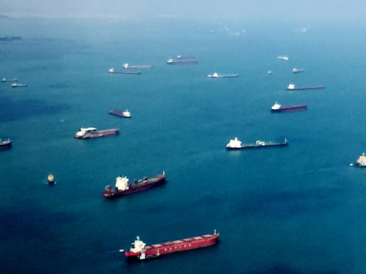
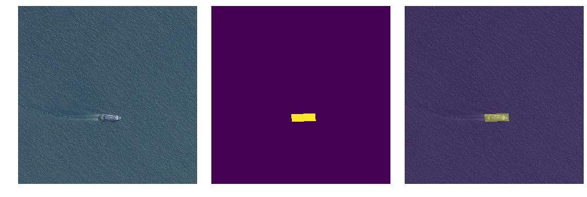
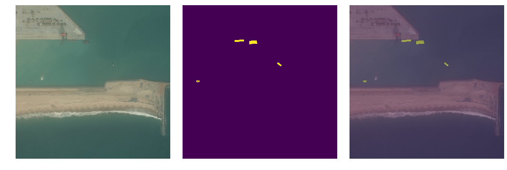
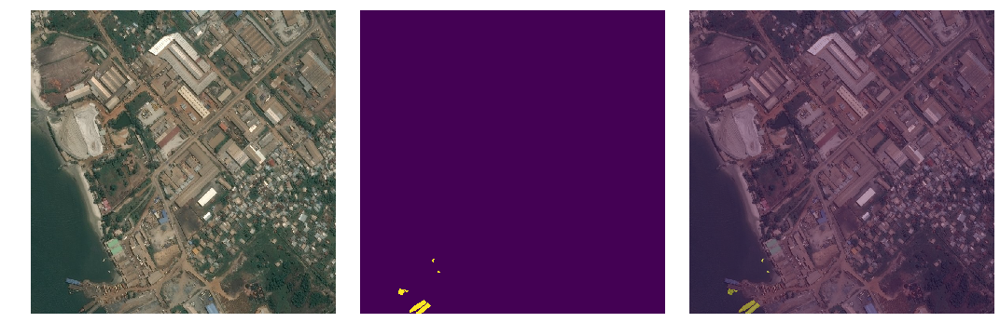
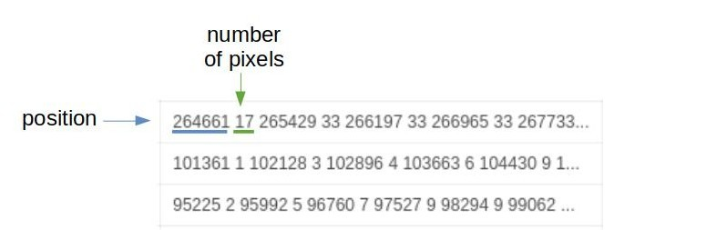
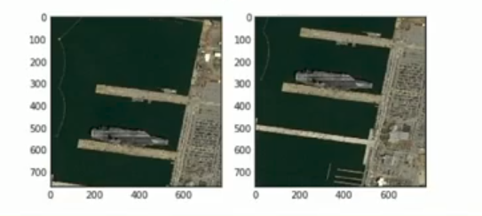
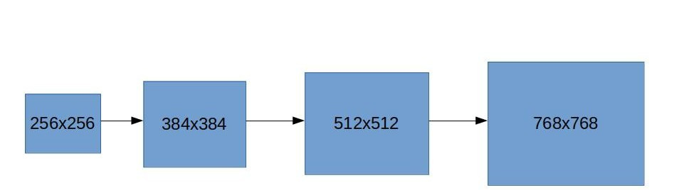

   

Image from the Airbus Ship Detection competition on Kaggle.

I recently participated in the [Airbus Ship Detection](https://www.kaggle.com/c/airbus-ship-detection) competition that was hosted on Kaggle. Airbus is a European aerospace corporation that designs, manufactures, and sells civil and military aerospace products worldwide. This was my first deep learning and computer vision competition on the platform so i'll go over some of the tips and techniques that I learned throughout the process.

Looking at the overview of the competition, we can see that the objective is to build a model that can detect ships in satellite images. We are given ~190K images for training and ~15K for testing. The images consist of square 768x768 crops taken from a larger, higher resolution image. Below are some examples of images and their respective ship masks.

Left: Satellite Image. Center: Ship mask. Right: Mask laid on top of satellite image.
 The masks are stored using a technique know as run length encoding (RLE). Since the majority of each mask contains non-ship pixels, RLE flattens the whole mask image into a single 1D array of numbers and takes the start position of a ship pixel followed by the number of successive ship pixels following it in the array. This results in an efficient way of storing each of the masks in a single array.

Ship mask stored in run length encoding format.
 Seeing how the individual images were just crops of a much larger image, I noticed that some of the ships were duplicated across different images. There seemed to be an overlap in the crops of a lot of the images causing the same ships to appear in different images. This would be a problem when building a cross validation strategy since the same ships could appear in both the train and validation sets, causing a leak of information. The solution I came up with to prevent this was to check the area covered by each of the masks and the shape that they took. Those with the same area and shape meant that they were the same ship. I simply grouped these images together to make sure they were not in the validation set. One other thing I did was to stratify the training set according to the number of ships in each mask. The number of ships in each image varied so it was a good idea to make groups of images based on this distribution.

Duplicated ships across different images.
Majority of the images did not have any masks at all. The first thing I did was to create a classifier that predicted whether an image had ships or not. For most of the competition, I used the [fastai](https://github.com/fastai/fastai) deep learning framework. Fastai is a wrapper around Pytorch that abstracts a lot of the underlying setup for training neural networks. All architectures used were [ResNet](https://arxiv.org/pdf/1512.03385.pdf) based, something that was easy to access with the framework. The ship classifier was an ensemble of several ResNet architectures with pretrained weights. I used several techniques to improve the performance of this model. The first was gradually increasing the size of the training images. Starting from 256x256 images, I trained for a few epochs, resized the images to 384x384, then trained some more. I did this again for 512x512 then finally the full 768x768 images. By increasing the size of our images every few epochs, the model is able to gradually take in more and more information and we are able to achieve a slightly higher accuracy.

Gradually increasing the size of the training images.
 Another technique I used was differential learning rates. The concept of differential learning rates is to vary the learning rates for different parts of the network. Traditionally, I single learning rate is used for the entire network when doing backpropagation. This technique is best used when doing transfer learning with pretrained weights. Earlier layers of the network have already learned a good set of general low level features and therefore their weights do not need to be changed as much. As we move forward in the network, the learned features become less abstract and would need to be changed at a faster rate. I split the network into three parts: the first half, the second half minus the last layer, and the last layer. The first half would have the lowest learning rate, while the last layer of the network would have the highest. This technique helps our last few layers to change weights more quickly while keeping weights in the earlier layers to remain intact for the most part. Using just these two techniques, I was able to achieve >99% accuracy for the ship classifier.

In the next post, i'll go over the segmentation network that predicts masks for the ship images.
