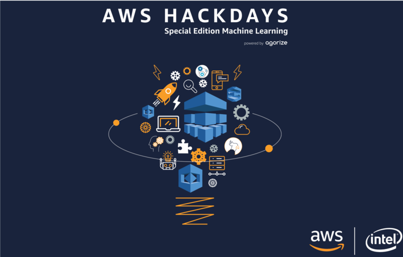
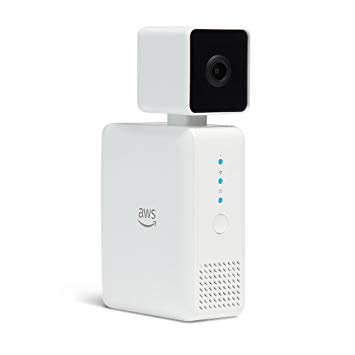
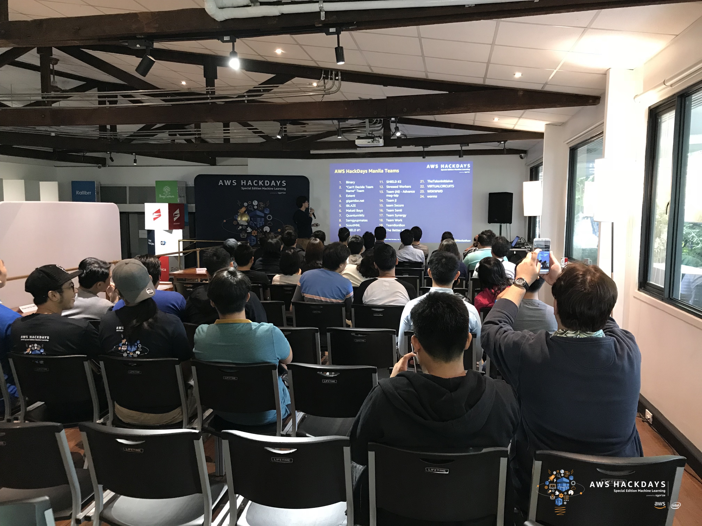
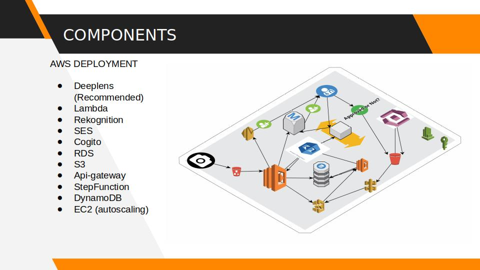
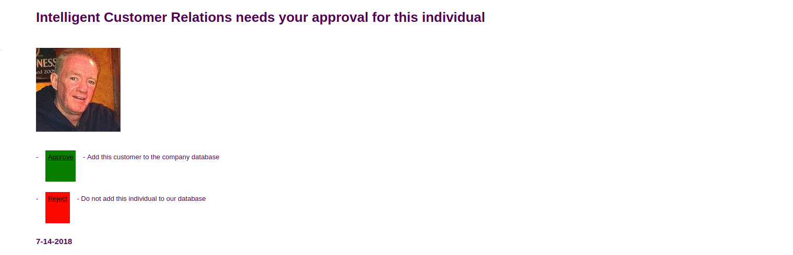
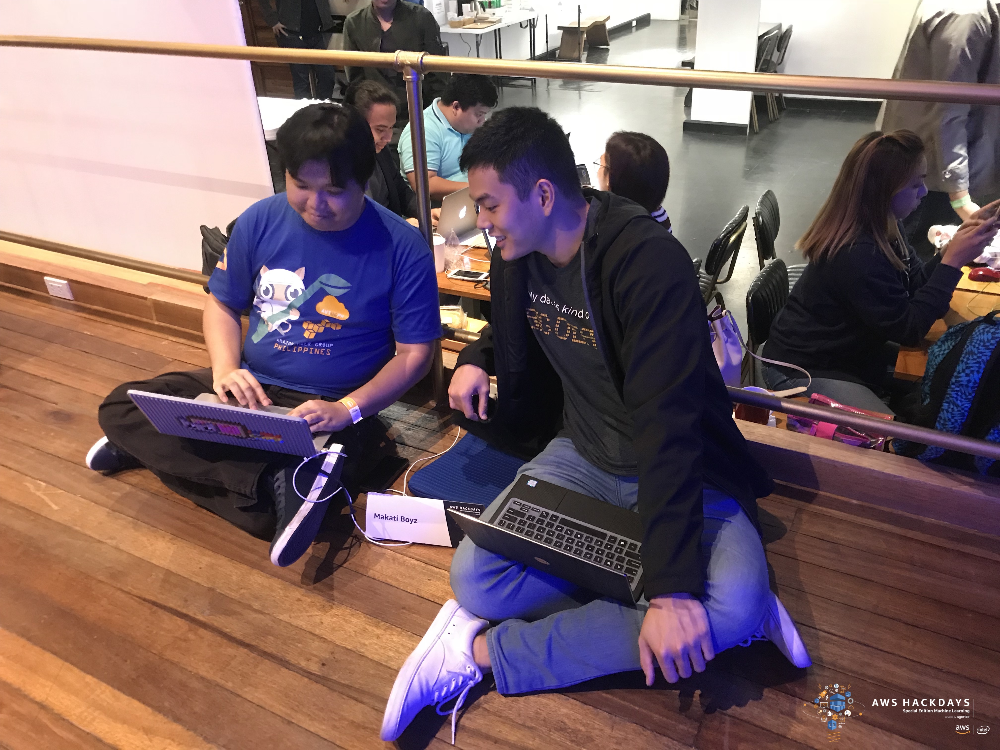

Last July 14, Amazon Web Services (AWS) held its very first [hackdays challenge](https://aws.agorize.com/en/challenges/manila?lang=en) in Manila, Philippines. Hackdays is a day-long event that challenges developers to create products that innovate in one of four different industries. These include transportation, media, e-commerce, and fintech. Being a machine learning competition, one of the requirements was for the product to incorporate AWS' machine learning services. Prior to the actual event, initial product summaries were submitted online where judges selected the top teams to move on to the event proper.
 
Aside from the hackdays event that was held in Manila, five other hackdays were held in different cities across Southeast Asia. The other participating cities were Singapore, Ho Chi Minh City in Vietnam, Kuala Lumpur in Malaysia, Jakarta in Indonesia, and Bangkok in Thailand. The winners from the each of these cities will go on to compete against each other until a single champion from Southeast Asia is crowned.

AWS Hackdays Special Edition Machine Learning

Together with an old co-worker and a couple of other friends, we formed a team called the Makati Boyz. The name comes from Makati City, the city where all of us were based in at the time. Even before the challenge was announced, we already had some ideas for use cases of machine learning that we were eager to implement. The industry we chose was e-commerce, the area where a lot of us were currently working at the time. The basic idea of our product was to use facial recognition to be able to gather data and insights from customers that shopped in brick and mortar stores. We wanted to answer questions such as which customers would visit a store most frequently, how much were certain customers spending in a store per month/week, which areas of a store had the highest density of people, etc. By being able to identify and track individual customers as they made their way around the store, we would be able to effectively manage store layouts and increase customer retention through different forms of targeted marketing.

AWS had recently released a new product called the [DeepLens.](https://aws.amazon.com/deeplens/) The DeepLens was touted as the first deep learning enabled camera, allowing developers to deploy deep learning algorithms directly on the device and making the development of computer vision applications easier than ever. This was just what we needed for the product that we had in mind. The device itself was not available locally but one of our members was able to get one when he attended re:Invent the year earlier. This is what we used during the competition.

The AWS DeepLens

The team met several times a week over the course of a month, discussing both the technical and business details of the project. With all the hype around machine learning and artificial intelligence, it was important for us not to lose sight of our main business objective and the utility we could provide to organizations. We had to find a good mix between cutting-edge technology as well as usefulness to other businesses. The professional backgrounds of our team members varied from software engineering, cloud computing, and business development. This mix of different people allowed us to maximize each of our strengths, making sure that everyone's opinion was heard during our discussions. Since some of our members had day jobs, we would meet on weeknights, usually until the early hours of the following day. Our work paid off as we were lucky enough to make it through the initial screening and into the final leg of the competition. We would finally be able to make a working prototype of our product that we could show to other people. 

Arriving early on the day of the event, I found that there were 24 teams in total that made it to the last round. After a light breakfast we were all briefed regarding the competition rules and deadlines. We had 12 hours to complete a working prototype of our product, after which we would present to a panel of distinguished judges. The winner would be decided after all the teams had presented and the judges had finished their deliberation.

Competition day briefing

Working on the project under the pressure of competition was a surreal experience. There is a certain "flow" that you achieve when you are working on something that commands all your attention. Hours pass like minutes and you lose track of time, your suroundings, your appetite, and basically everything else around you. Before I knew it, the sun was down and we had maybe an hour left to complete our prototype. Crunch time was fast approaching. Our team members' strengths worked well with one another despite the mounting pressure. While one member worked on our slide deck, another worked on configuring the DeepLens. Being the only team member with any knowledge and experience in deploying machine learning solutions, I personally developed and tested most of the project. I'll go over some of the technical details and show which AWS services we were using in the next section.

Crunch time...

###### Project Overview and Architecture

As I mentioned earlier, we were using the DeepLens to run our deep learning algorithms. These algorithms are generally trained on external data until they achieve an acceptable level of accuracy (or whatever metric you are optimizing for). The entire solution was written using AWS services. For our purposes, AWS had already pre-trained a few models that we took advantage of. One of the main components of our product was a [Resnet-50](https://arxiv.org/abs/1512.03385) that used the [Single Shot Multibox Detector (SSD)](https://arxiv.org/abs/1512.02325) framework for detecting faces. This was already pre-trained by AWS and had good documentation so we just built on top of it. I edited the existing [Lambda](https://aws.amazon.com/lambda/) function to be able to crop detected faces and send them as a json message to [IoT](https://aws.amazon.com/lambda/). From there, I created a separate Lambda function to save the json data into [S3](https://aws.amazon.com/s3/).

Project Architecture

After testing that the DeepLens was successfully saving faces to S3, I turned my attention to [Rekognition](https://aws.amazon.com/rekognition/) and made a collection to store data about our already detected faces. This allowed me to cross reference new faces with existing ones in our database. We could now effectively determine if we had seen a particular face in the past. The next step was to establish some sort of approval workflow that would alert the user when new faces were recognized. I used a [Step Function](https://aws.amazon.com/step-functions/) to orchestrate a manual approval process for new faces. I created a very basic static site where the user could enter details about the new face that could be saved in the database. After this, I configured an API gateway that would direct the user to the site that I just created. I also set up basic authentication to the site using [Cognito](https://aws.amazon.com/cognito/).

Nottification sample from our project

I now needed to tie all the components together to make the working prototype. I decided on a simple email notification for approving new faces. After registering on [SES](https://aws.amazon.com/ses/), I made another Lambda function that would trigger SES to send an email to the user when new faces were detected. This email showed the user the image of the new face and gave them the option to approve or reject it. If they wanted to approve the new face, they could click on a button that would direct them to the site that I made, asking them for further information before saving the new face to the database. Lastly, I set up a separate database with [DynamoDB](https://aws.amazon.com/dynamodb/) to save the face collection from Rekognition. After that, the prototype was basically done with everything from the face detection to the approval workflow all in place.

Squeezing in some last minute edits

I tested the prototype for the remainder of the alloted time, making sure that it was working as intended. With all the hard work behind us, the only thing left was to present it to the judges and hope that they liked our work. My teammates had worked on the presentation and showed a few practical use cases for the product. There were three judges that included the country head of AWS, a successful startup founder, and a senior developer working on different kinds of emerging technologies. There was a hint of anxiety as well as tension in the air as the competitors rushed to make last minute edits to their products and presentations. Our presentation finished early on and I spent the rest of the time seeing what the other teams had worked on. 

Team presentations

Quite frankly, I was blown away with some of the other products that were presented. There were all these interesting ideas like an automated video highlights creator, an AI powered trip planner, and a machine learning based financial accountant. In a way though, I was not surprised. I knew a lot of the other competitors personally and they were some of the most talented and accomplished data scientists and technology professionals in the country. Many of them had several degrees under their belt and several decades of experience in the field. I might have been punching above my weight class, being only a few years out of university.

By the end of all the presentations, I felt that there was no clear winner and that everyone was more or less on equal footing. Anyone could have gotten the victory. The judges retreated to a room at the back of the venue and deliberated for the next half hour. They then came out and started announcing the winners. With the suspense at its breaking point, I was stunned when they announced that my team had won the grand prize! We had unanimously gotten the winning vote from all the judges and came out on top of 23 other teams. There was an awarding ceremony where we were given a large sign to show our victory. There was also a bunch of press lined up for interviews after the whole event. [Here is one of their articles.](https://www.manilatimes.net/aws-hackdays-ph-champion-to-compete-in-jakarta/421833/)

Despite the grueling day of work that we just finished, we are not yet done. Our next stop is Jakarta, where we'll be racing self-driving robocars against the very best in the region. Game on.

Awarding

